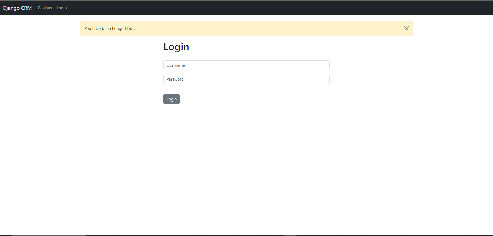
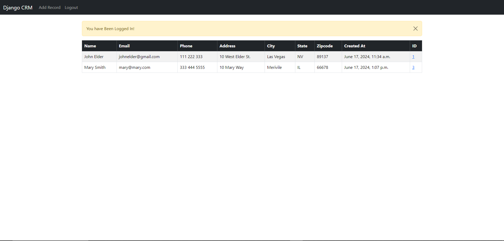
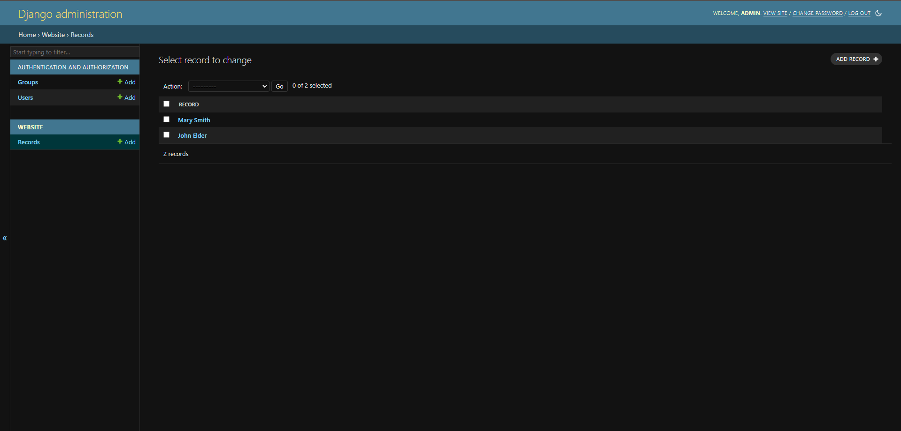

# **Django CRUD Operations and Authentication**
This project demonstrates how to implement CRUD (Create, Read, Update, Delete) operations along with user authentication (login and logout) in a Django application.

## **Prerequisites**
    - Python 3.x
    - Django 3.x or later
    - Virtualenv (optional but recommended)

## **Setup**
1. **Clone the repository**

    - git clone https://github.com/yourusername/yourproject.git
    - cd dcrm

2. **Create and activate a virtual environment**
   - `python -m venv venv`
   - `source venv/bin/activate`  # On Windows, use `venv\Scripts\activate`

3. **Install dependencies**
   - pip install django
   - pip install mysql
   - pip install mysql-connector` (if this doesn't work then try `pip install mysql-connector-python`)

4. **Run migrations**
    - python manage.py makemigrations
    - python manage.py migrate

5. **Create a superuser**
    - python manage.py createsuperuser

6. **Run the server**
    - python manage.py runserver

**Application Structure**
- `models.py`: Defines the Record model used for CRUD operations.
- `forms.py`: Contains the AddRecordForm for creating and updating records.
- `views.py`: Contains views for handling CRUD operations and user authentication.
- `urls.py`: URL configuration for routing requests to appropriate views.
- `templates/`: HTML templates for rendering the pages.

**Summary**
    - This README provides a comprehensive guide to set up a Django project with CRUD operations and user authentication. Follow the instructions to get your project up and running. For further customization and enhancement, refer to the Django documentation.

**SCREENSHOTS**

